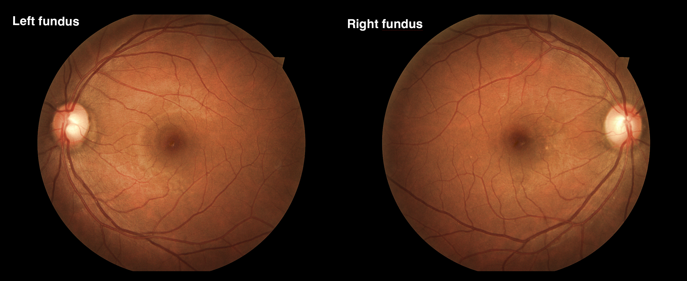

# Deep Learning Medical Helper

Helper framework for Medical Image Analysis

## In this project you can
 - [x] Classify left and right fundus images

## Set up environment
To run this framework properly, you should install some libraries in your environment. To do that, run this script:
```bash
pip install -r requirements.txt
```
## Modules
### 2.1. Classify Left and Right Fundus images


A lot of medical records including fundus images without labeling **'left'** or **'right'** eye. This module can help matching between fundus image to **'left'** or **'right'** eye. This module has the accuracy over 99% on 8000 images of [Lite EYEPACS dataset](https://www.kaggle.com/hmchuong/lite-eyepacs) and can be accepted on production environment.

To use this feature, simply import the module and create a classifier object:
```python
from medhelper.fundus.lrclassifier.classifier import LeftRightClassifier

clf = LeftRightClassifier()
```
Predict image at `image_path` you want:
```python
result = clf.predict('path/to/your/image')
```
The `result` is a dictionary with the structure:
```javascript
{
  'prob_left': 0.007223138585686684, // Probability of image is of left eye
  'prob_right': 0.9927768707275391, // Probability of image is of right eye
  'prediction': 'right', // 'left' or 'right', prediction label of image
  'need_check': False // True or False, if True, the image need to check manually
}
```

## Author
Minh-Chuong Huynh (minhchuong.itus@gmail.com)

## License
MIT
